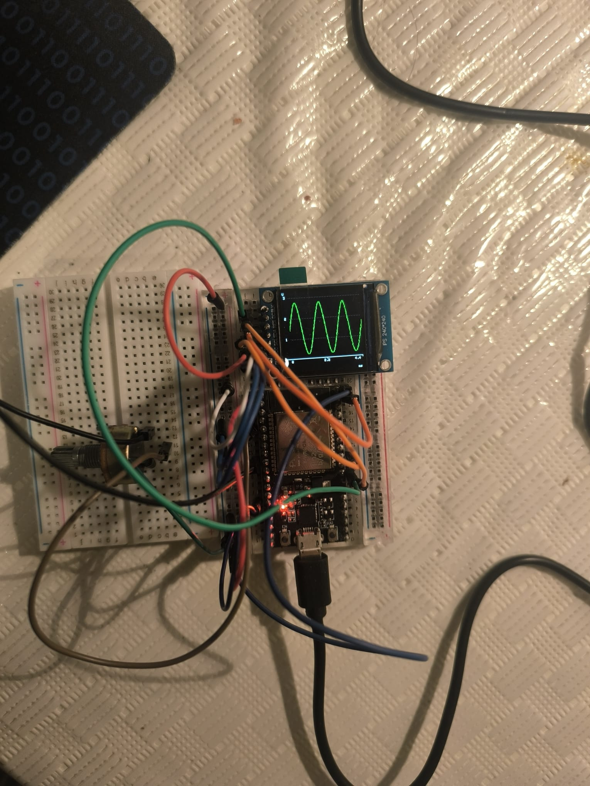
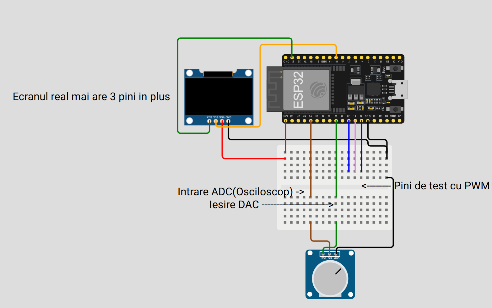

# ESP32 Mini Oscilloscope

  <h3>Un instrument de vizualizare a semnalelor analogice în timp real</h3>

 

<!-- Imaginea de ansamblu a setup-ului -->

  

 

Acest instrument a fost creat ca proiect pentru cursul de **Introducere în Robotică**, în anul 3 la Facultatea de Matematică și Informatică, Universitatea din București. Este scris în C++ (PlatformIO) folosind capabilitățile avansate ale microcontrolerului ESP32 și a fost dezvoltat pe parcursul unei luni.

Am ales acest proiect deoarece am vrut să depășesc limitările funcției standard `analogRead()` și să explorez arhitectura internă a ESP32 (DMA, I2S, Dual-Core). Obiectivul a fost crearea unui dispozitiv capabil să vizualizeze forme de undă rapid și precis, fără a depinde de echipamente de laborator costisitoare.

Provocarea principală a fost sincronizarea perfectă între generarea unui semnal de test și achiziția acestuia, rezolvată printr-o arhitectură software personalizată ("Burst Mode").

 

## 🎮 Mod de Utilizare

**ESP32 Mini Oscilloscope** este un sistem **controlat exclusiv prin interfață serială (CLI)**, dar cu afișare grafică pe un ecran TFT dedicat.

Obiectivul sistemului este: **Vizualizarea semnalelor electrice (0 - 3.3V).**

### Cum se folosește:
*   **Interfața:** Conectează ESP32 la PC și deschide Monitorul Serial (Baud 115200).
*   **Comenzi:** Tastează comenzi precum `help`, `trig on`, `gen sine` pentru a controla aparatul.
*   **Vizualizare:** Urmărește ecranul TFT pentru forma de undă și parametrii semnalului.

### Caracteristici:
*  **Rată de Eșantionare Variabilă** - Ajustabilă între 10 kSPS și 150 kSPS.
*  **Generator de Semnal Integrat** - Poate genera Sinus, Dreptunghiular, Triunghiular și Sawtooth (20Hz - 650Hz).
*  **Triggering Avansat** - Moduri AUTO, NORMAL (ON) și OFF, cu histerezis software configurabil.
*  **Statistici Live** - Calcul în timp real pentru Vmin, Vmax și Vpp (Peak-to-Peak).
*  **Burst Mode** - Arhitectură unică ce garantează un semnal generat fără jitter în timpul achiziției.

 

## 🛠 Componente Hardware

Setup-ul fizic este compus din următoarele:

*   💥 1 Placă de dezvoltare ESP32 (WROOM-32)
*   💥 1 Display TFT IPS 1.3 inch (Driver ST7789, 240x240 pixeli)
*   💥 Fire de legătură (Jumpers)
*   💥 Rezistențe/Potențiometru pentru atenuarea semnalului de test

### Conexiuni
*   **DAC (Ieșire):** GPIO 25
*   **ADC (Intrare):** GPIO 34
*   **PWM Test (Hardware):** GPIO 27, 14, 12
*   **Display SPI:** Pini standard VSPI (MOSI, SCLK, CS, DC, RST).

### Diagramă Proiect
Obs: In diagrama pinii de la ecran nu sunt corecti deoarece componenta din diagrama este pe I2C si in realitate este SPI.

  

 

## 📺 Video Youtube

   

 

Mai jos este prezentarea tehnică a proiectului ESP32 Mini Oscilloscope.

## Arhitectură Software

La baza proiectului stă o arhitectură **Dual-Core Asimetrică** combinată cu un Scheduler de tip **"Burst & Snapshot"**.

Sistemul este împărțit între cele două nuclee ale procesorului:

1.  **Core 0 (Scope Engine):**
    *   Dedicat exclusiv achiziției de date.
    *   Folosește perifericul **I2S** în mod ADC pentru a transfera datele direct în RAM prin **DMA (Direct Memory Access)**.
    *   Nu consumă cicluri de procesor pentru citirea efectivă a voltajului, permițând viteze mari (până la 150 kSPS).

2.  **Core 1 (Application Logic):**
    *   Rulează bucla principală `loop()`, interfața serială și desenarea pe ecran.
    *   Implementează logica de "Burst Generation" pentru stabilitate.

### Burst Mode & Snapshot Logic

Pentru a rezolva problema clasică a "jitter-ului" (instabilitatea semnalului generat când procesorul face și alte sarcini), am implementat o structură de execuție în două faze:

1.  **Faza BURST (Critical Section):**
    *   Timp de ~25ms, procesorul **doar generează semnal** (DAC) într-o buclă strânsă, cu timing precis la microsecundă.
    *   În acest timp, DMA-ul (Core 0) umple buffer-ul cu datele perfecte.
2.  **Faza SNAPSHOT (Relaxed Section):**
    *   După ce buffer-ul este plin, oprim generarea critică.
    *   Copiem datele, căutăm Trigger-ul software, calculăm statisticile (Vpp) și desenăm graficul pe ecran.
    *   Verificăm comenzile venite prin Serial.

## Comenzi Disponibile (CLI)

Interfața serială permite controlul complet fără a recompila codul.

| Comandă | Parametri | Descriere |
| :--- | :--- | :--- |
| `gen` | `sine`, `sqr`, `tri`, `saw` | Schimbă forma de undă a generatorului intern. |
| `genf` | `20.0` - `650.0` | Setează frecvența generatorului (Hz). |
| `trig` | `on`, `off`, `auto` | Setează modul de sincronizare. |
| `triglev`| `0.0` - `3.3` | Setează nivelul de trigger (Volți). |
| `samp` | `10.0` - `150.0` | Setează rata de eșantionare (kSPS). |
| `color` | `verde`, `rosu`, etc. | Schimbă culoarea traseului pe ecran. |
| `stats` | (fără) | Activează/Dezactivează afișarea Vmin/Vmax/Vpp. |
| `help` | (fără) | Afișează lista comenzilor. |

### Optimizări Tehnice

*   **Display Slicing:** Desenarea pe ecran (operațiune lentă prin SPI) a fost optimizată pentru a minimiza timpul mort, folosind funcții grafice eficiente din biblioteca `TFT_eSPI`.
*   **Buffer Management:** Se utilizează buffere duble (Ping-Pong) la nivel de DMA și un buffer "Snapshot" la nivel de aplicație pentru a preveni efectul de "screen tearing" (ruperea imaginii).
*   **Non-Blocking Serial:** Parserul de comenzi este scris caracter-cu-caracter, eliminând funcțiile blocante precum `readStringUntil`, asigurând fluiditatea sistemului.

### Fizica și Triggering-ul

Sincronizarea imaginii (Triggering) este realizată software printr-un algoritm de **Histerezis**.
*   Nu este suficient ca semnalul să treacă de un prag (ex: 1.5V).
*   Algoritmul verifică o fereastră de eșantioane anterioare (`HYST_WINDOW`) pentru a confirma că semnalul este într-adevăr în creștere (Rising Edge) și nu este doar zgomot.

## Concluzii

*   Proiectul demonstrează capacitatea ESP32 de a funcționa ca un sistem de achiziție de date performant, depășind cu mult capabilitățile unui Arduino standard.
*   Separarea sarcinilor pe nuclee (Core 0 vs Core 1) și utilizarea DMA sunt esențiale pentru aplicații de timp real ("Real-Time").
*   Arhitectura "Burst Mode" este o soluție creativă pentru a obține un generator de semnal curat fără hardware extern dedicat.
